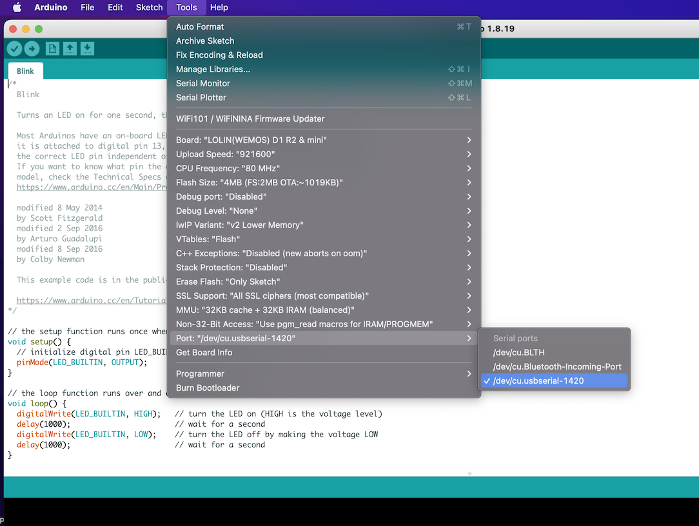

# First example

Blink the onboard LED: 1 second on, 1 second off, 1 second on, etc.

# Connect the WEMOS D1

Connect the WEMOS D1 to your computer using the USB cable.

In the Arduino IDE, select the port that connects to your WEMOS



# Blink source code

```cpp
void setup() {
  // initialize digital pin LED_BUILTIN as an output.
  pinMode(LED_BUILTIN, OUTPUT);
}

// the loop function runs over and over again forever
void loop() {
  digitalWrite(LED_BUILTIN, HIGH);   // turn the LED on (HIGH is the voltage level)
  delay(1000);                       // wait for a second
  digitalWrite(LED_BUILTIN, LOW);    // turn the LED off by making the voltage LOW
  delay(1000);                       // wait for a second
}
```

Compile and upload your firmware ▶️

Enjouy your blinking LED 😁
