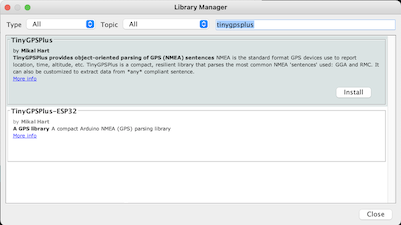

# GPS

## Connect

| Pin  | Description |
| ----- | ----------- |
| VCC | Red (straight) wire to VCC (3.3V) busbar 
| GND | Black (straight) wire to GND busbar 
| TX | Purple (straight) wire to D5
| RX | Not connected to D6


### Serial connection

The GPS device is connected to the Wemos ove the serial inteface (TX (transmit) is the only pin connected, RX on the GPS is not connect as we do not need to instruct the GPS).

The GPS communicates at 9600 baud.

The GPS is not connected to the hardware serial of the Wemos, as this is already used for uploading code and debugging messages. Instead, we use 2 arbitrary pins (D5 and D6) for serial software communication (this is fine as communication is only at 9600 baud).

### Software

Install Tinygps using the library manager.



```cpp
const uint8_t RXPin = D5;
const uint8_t TXPin = D6;
const uint32_t GPSBaud = 9600;

// The TinyGPSPlus object
TinyGPSPlus gps;

// The serial connection to the GPS device
SoftwareSerial ss(RXPin, TXPin);

...

  ss.begin(GPSBaud);

```

### Serial communication
```cpp
  // Dispatch incoming characters
  while (ss.available() > 0)
    gps.encode(ss.read());

  // check is info has arrived
  ...
```

## Getting a GPS signal - Antenna

The GPS works best when the antenna is outdoor and has free range. Getting a GPS fix inside a building is difficult. Place the antenna as close as possible to the window.

Getting a fix might take time, up to 15 minutes.

### Time comes first

The GPS gets time before a location fix. When you get time, it indicates that communication is fine between the GPS and the Wemos, and that the antenna 'sees' something.